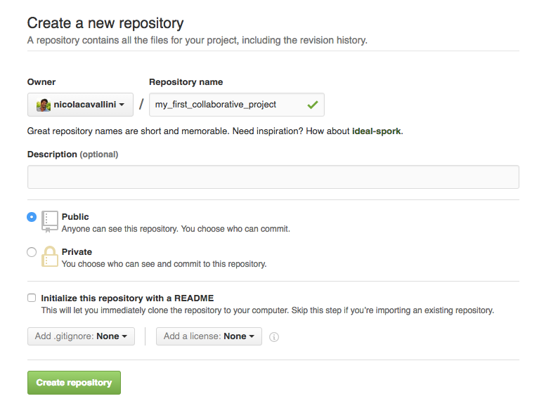
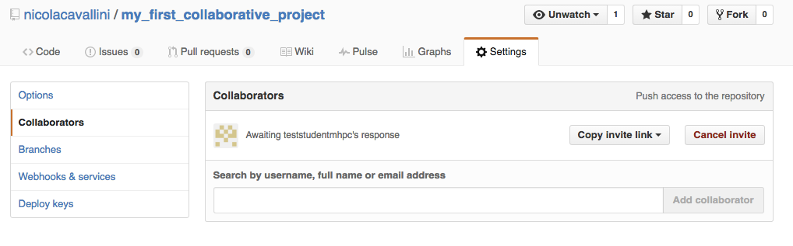
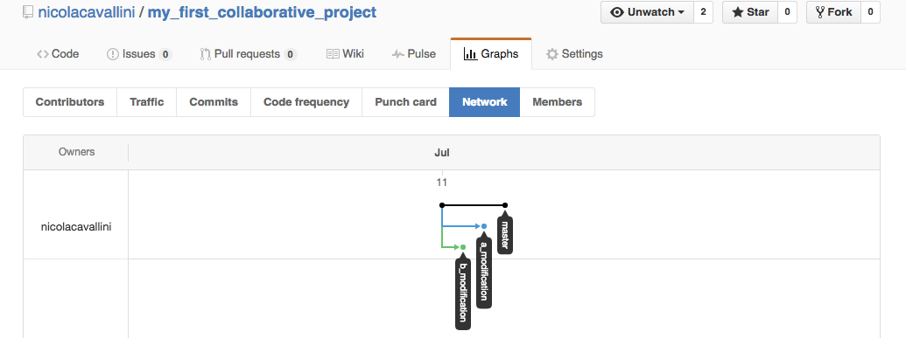
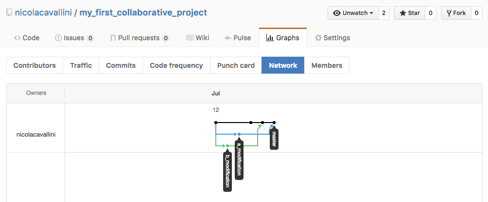

# My First Collaborative Project

## The Template Text

```
This is an extremely interesting text.
This is the result to he work of AStudent 
and BStudent.

Meanwhile BStudent calls up AStudent. BStudent 
tells him he will improve this part of the text, 
he will do this on a different branch so that he 
will not interfere with AStudent’s work.
*PLACE HOLDER: BSTUDENT HAS A CRUCIAL IMPROVEMENT*

AStudent suddenly realises that there is a 
very nice text, that copes very nicely with 
what BStudent is about to write. This is why 
he is creating a new branch and writing 
his text here. 
*PLACE HOLDER: ASTUDENT'S TEXT*

Before merging the two branches, AStudent
writes a very nice conclusion for the document
and commits it.
*PLACE HOLDER: ASTUDENT'S TEXT*
```

## Collaborative Development


This is meant to be a simple collaborative project between `AStudent` and `BStudent`.

In this example case `AStudent=nicolacavallini`, `BStudent=teststudentmhpc`.

```
username = teststudentmhpc
password = mhpc2016
```

`AStudent` creates a directory:

```
$ mkdir my_first_collabiorative_project
```

Stats a new file called `very_interesting_text.txt` and edits the template text above.

Now `AStudent` starts version controlling this repository using git:

```
$ git init
Initialized empty Git repository in /Users/nicola/mhpc/my_first_collaborative_project/.git/
```

`AStudent` asks git what's the status of the repository he created:

```
$ git status
On branch master

Initial commit

Untracked files:
  (use "git add <file>..." to include in what will be committed)

	very_interesting_text.txt

nothing added to commit but untracked files present (use "git add" to track)
```

Now `AStudent` tells git he wants to control `very_interesting_text.txt`:

```
$ git add very_interesting_text.txt
```

Check the status again to make sure git understood correctly:

```
$ git status
On branch master

Initial commit

Changes to be committed:
  (use "git rm --cached <file>..." to unstage)

	new file:   very_interesting_text.txt

```

Now git is suggesting us that the file is ready to be committed, and we agree with git in this case:

```
$ git commit -m "first commit"
[master (root-commit) 15ec2cc] first commit
 1 file changed, 0 insertions(+), 0 deletions(-)
 create mode 100644 very_interesting_text.txt
```

The developed repository is only local at the moment. Suppose we want to add a remote copy of our repository. To do this we sign in on github, and create a repository with the very same name (to simplify things) of our local repo, see the image:



We want to exchange information in between the local repository  and the remote one. To do this we need to tell git there exists a `url` (in the git language the remote it is just an url) that corresponds to our remote repository:

```
$ git remote add origin https://github.com/nicolacavallini/my_first_collaborative_project.git
```

By convention the first `remote` we add is called `origin`. 

To publish (`push` in the git language) our work on the repository we need to:

```
$ git push origin master
Username for 'https://github.com': nicolacavallini
Password for 'https://nicolacavallini@github.com': 
Counting objects: 3, done.
Delta compression using up to 4 threads.
Compressing objects: 100% (3/3), done.
Writing objects: 100% (3/3), 562 bytes | 0 bytes/s, done.
Total 3 (delta 0), reused 0 (delta 0)
To https://github.com/nicolacavallini/my_first_collaborative_project.git
 * [new branch]      master -> master
```

It is time for `BStudent` to join the game, first `AStudent` has to give him permission to edit the project:



Then `BStudent` clones his own local version of the repository:

```
$ git clone https://github.com/nicolacavallini/my_first_collaborative_project.git
$ cd my_first_collaborative_project/
```

`BStudent` creates his own branch for his modifications:

```
$ git checkout -b b_modification
Switched to a new branch 'b_modification'
```


`BStudent` edits his modification.

```
$ git status
On branch b_modification
Changes not staged for commit:
  (use "git add <file>..." to update what will be committed)
  (use "git checkout -- <file>..." to discard changes in working directory)

	modified:   very_interesting_text.txt
```

We should be familiar by now with adding and committing our modifications:

```
$ git add very_interesting_text.txt
$ git commit -m "b modification"
[b_modification bc2fb56] b modification
 1 file changed, 1 insertion(+), 1 deletion(-)
```

`AStudent` does the same:

```
$ git checkout -b a_modification
Switched to a new branch 'a_modification'
$ git diff
diff --git a/very_interesting_text.txt b/very_interesting_text.txt
index 5f74e97..0e4cce7 100644
--- a/very_interesting_text.txt
+++ b/very_interesting_text.txt
@@ -13,7 +13,7 @@ very nice text, that copes very nicely with
 what BStudent is about to write. This is why 
 he is creating a new branch and writing 
 his text here. 
-*PLACE HOLDER: ASTUDENT'S TEXT*
+This is a text that couples well with Bstudent's
```

```
$ git add very_interesting_text.txt 
$ git commit -m "a modification"
```

`AStudent` writes the conclusion before the two works are merged. First he gets back to the master branch:

```
$ git checkout master
Switched to branch 'master'
```

Then he edits the conclusions:

```
$ git diff
diff --git a/very_interesting_text.txt b/very_interesting_text.txt
index 2e9fe27..3c0bd13 100644
--- a/very_interesting_text.txt
+++ b/very_interesting_text.txt
@@ -18,4 +18,4 @@ his text here.
 Before merging the two branches, AStudent
 writes a very nice conclusion for the document
 and commits it.
-*PLACE HOLDER*
+This is the end, myo only friend the end!
```

```
$ git add very_interesting_text.txt 
$ git commit -m "conclusion"
[master 047fddf] conclusion
 1 file changed, 1 insertion(+), 1 deletion(-)
$ git push origin master
Counting objects: 3, done.
Delta compression using up to 4 threads.
Compressing objects: 100% (3/3), done.
Writing objects: 100% (3/3), 319 bytes | 0 bytes/s, done.
Total 3 (delta 1), reused 0 (delta 0)
To https://github.com/nicolacavallini/my_first_collaborative_project.git
   5b01174..047fddf  master -> master
```




`BStudent` now takes the responsibility to merge the work together. To do so he has to `fetch` the informations on the remote branch:

```
$ git fetch
remote: Counting objects: 6, done.
remote: Compressing objects: 100% (4/4), done.
remote: Total 6 (delta 3), reused 5 (delta 2), pack-reused 0
Unpacking objects: 100% (6/6), done.
From https://github.com/nicolacavallini/my_first_collaborative_project
 * [new branch]      a_modification -> origin/a_modification
   edda7a7..b74ff8f  master     -> origin/master
```


`Bstudent` goes back on `master` and starts merging the work together:

```
$ git checkout master
Switched to branch 'master'
Your branch is behind 'origin/master' by 1 commit, and can be fast-forwarded.
  (use "git pull" to update your local branch)
```

Git is warning `BStudent` that his local branch is not up to date. To do so `BStudent` needs to `pull` from the remote:

```
$ git merge origin/master 
Updating edda7a7..b74ff8f
Fast-forward
 very_interesting_text.txt | 2 +-
 1 file changed, 1 insertion(+), 1 deletion(-)
```

`BStudent` can merge the work he did. A default message will appear, committing the merging operation into a new commit:

```
$ git merge b_modification 
Auto-merging very_interesting_text.txt
Merge made by the 'recursive' strategy.
 very_interesting_text.txt | 2 +-
 1 file changed, 1 insertion(+), 1 deletion(-)
```

The very same process can be operated on the work done by `AStudent`:

```
$ git merge origin/a_modification 
Auto-merging very_interesting_text.txt
Merge made by the 'recursive' strategy.
 very_interesting_text.txt | 2 +-
 1 file changed, 1 insertion(+), 1 deletion(-)
```


```
$ git push origin master 
```

